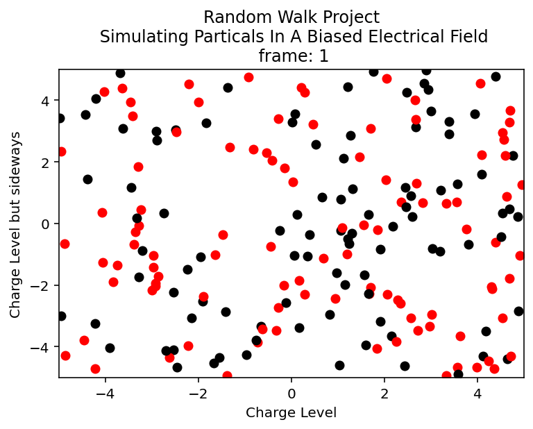

# COMP SCI 4S – Random Walk Project

**By Evan, Kima, and Hans**

## Overview

This project simulates **charged particles moving inside a closed container while experiencing a biased electric field**. Each particle performs a **random walk**, but the direction of motion is influenced by its charge, creating a biased movement pattern within the defined field boundaries.

The simulation tracks particle positions over time and displays their movement across a series of frames using scatter plots.

## Simulation Description

Each particle in the simulation has:

* A **charge** (0 or 1)
* A **position (x, y)** inside the defined container
* A series of positions that represent its **movement over time**

At every simulation step:

1. A particle attempts to move a fixed **step size**.
2. The direction of movement is randomly generated.
3. The particle's **charge biases the direction of movement**, simulating the effect of an electric field.
4. The program ensures the particle **remains inside the container boundaries**.
5. The new position is stored for visualization.

## Visualization

The simulation produces a series of scatter plots showing particle movement across frames.

* **Red particles** represent one charge type.
* **Black particles** represent the other.

These frames can also be combined into an animation to visualize particle movement over time.

## Example Simulation
(btw gif needs to be updated to reflect avoided particle collisions)


## Inputs

When running the program, the user is asked to provide:

* Number of particles
* Step size (distance traveled each step)
* Number of animation frames
* Minimum and maximum **x-coordinate** of the container
* Minimum and maximum **y-coordinate** of the container

## Files

The project is organized into three main files:

```
main.py
simulation.py
display.py
(and maybe control.py idk)
```

**main.py**
Handles user input and starts the simulation.

**simulation.py**
Generates particles and calculates their movement throughout the simulation.

**display.py**
Displays particle positions as scatter plots for each frame.

## Requirements

This project requires:

* Python 3
* `matplotlib`

Install dependencies with:

```
pip install matplotlib
```

## Running the Program

Run the main script:

```
python main.py
```

Then enter the simulation parameters when prompted.

## Project Goal

The goal of this project is to demonstrate how **random walks and biased movement** can be used to simulate particle motion under the influence of an external force such as an **electric field**.

---

## Authors

Evan,
Kima,
and
Hans
